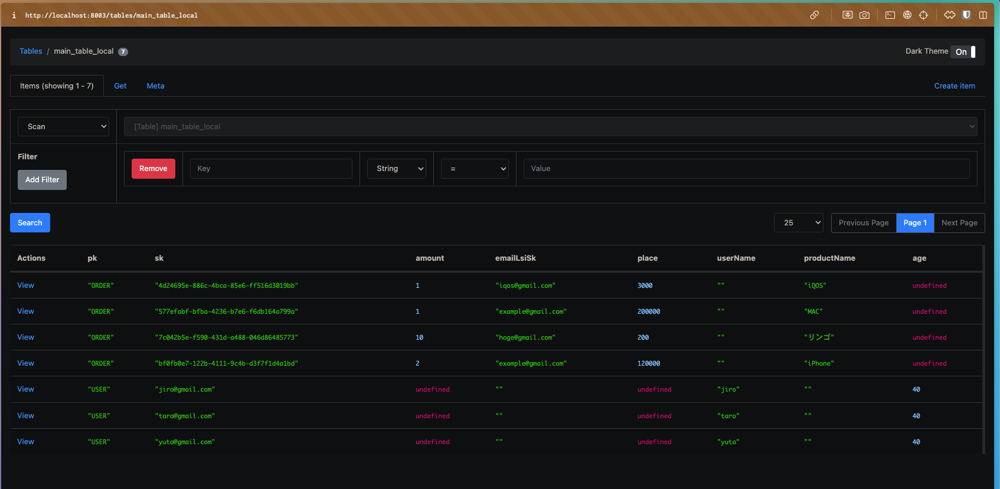
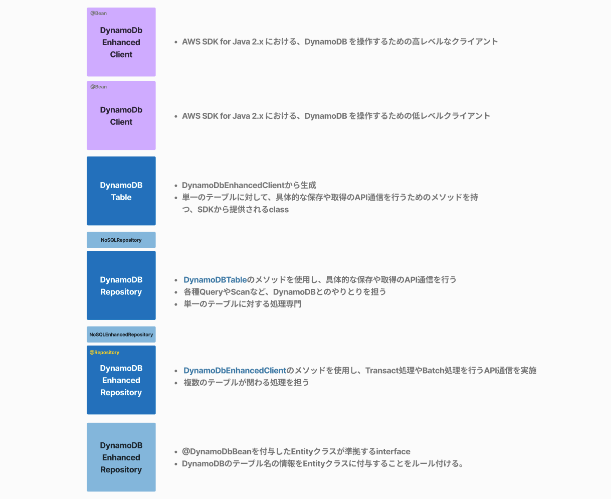
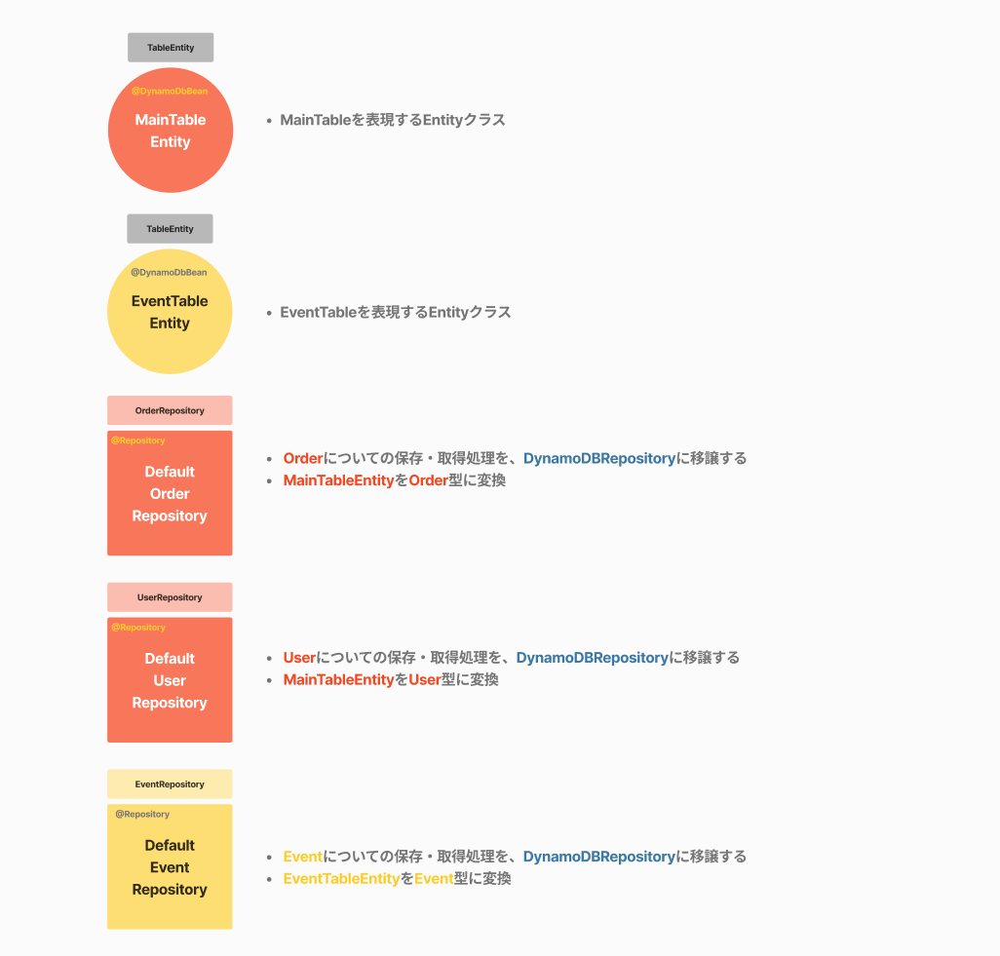

# Architecture for using DynamoDB with Spring Boot

## 継承設計パターン

Spring BootでDynamoDBを扱う上で、どのようなアーキテクチャを組んだら幸せになるか考える
https://github.com/yuta-shoji/springboot-dynamodb/tree/main

1.

継承設計パターン（[mainブランチ](https://github.com/yuta-shoji/springboot-dynamodb/tree/main), [extends-patternブランチ](https://github.com/yuta-shoji/springboot-dynamodb/tree/extends-pattern)）

2. DI設計パターン（[di-patternブランチ](https://github.com/yuta-shoji/springboot-dynamodb/tree/di-pattern)）

このブランチでは、継承設計パターンで実装されています

## 起動方法

### .envの記述

```txt
export DYNAMODB_ENDPOINT=http://localhost:8881
export DYNAMODB_REGION=ap-northeast-1
export DYNAMODB_TABLE_NAME_SUFFIX=local
```

### DynamoDB-Local, DynamoDB-Admin 起動

```bash
docker compose up
```

### Spring Boot起動

```bash
make start
```

起動すると`DynamoDBInitializer`が作用し 、自動的に`main_table_local` `event_table_local`の2テーブルが作成されます。

### DynamoDB Local AdminのGUIにアクセス

http://localhost:8003 簡単なGUIでテーブル操作を行うことができます。


## 設計指針

「JPAライク」に重きを置いた設計です。
後に説明する`DynamoDBRepository`を、各Repositoryが継承して、抽象化された`DynamoDBRepository`
のメソッドを使用してQueryやScan、Saveをするという設計思想です。





## エンドポイント

### OrderController

| Path                               | Use case                |
|------------------------------------|-------------------------|
| [GET] `/api/orders`                | 全ての注文情報を取得              |
| [GET] `/api/orders/{id}`           | idを元に注文情報を取得            |
| [GET] `/productName/{productName}` | 製品名を元に注文情報の配列を取得        |
| [GET] `/email/{email}`             | 購入者のemailを元に注文情報の配列を取得  |
| [GET] `/events/batch`              | バッチで注文情報とイベント情報を同時に取得   |
| [PUT] `/`                          | 注文情報を保存                 |
| [POST] `/events`                   | トランザクションで注文情報とイベント情報を保存 |

### UserController

| Path             | Use case          |
|------------------|-------------------|
| [GET] `/`        | 全てのユーザー情報を取得      |
| [GET] `/{email}` | emailを元にユーザー情報を取得 |
| [POST] `/`       | ユーザー情報を保存         |

### EventController

| Path                           | Use case               |
|--------------------------------|------------------------|
| [GET] `/`                      | 全てのイベント情報を取得           |
| [GET] `/eventType/{eveytType}` | イベントタイプを元にイベント情報の配列を取得 |
| [POST] `/`                     | イベント情報を保存              |